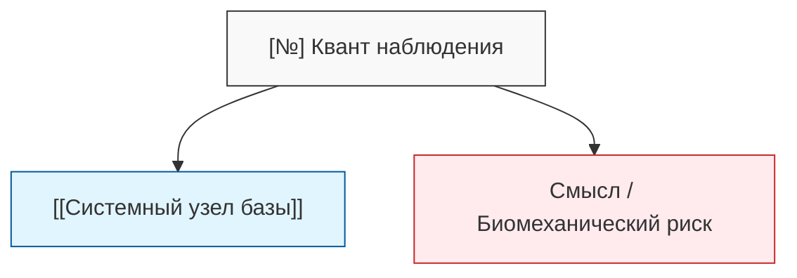

# Method - Milestone Chunking & Synthesis Protocol

## 1. Назначение и контекст
Протокол регламентирует процесс конвертации сырых полевых наблюдений, стенограмм и быстрых отметок инцидентов (L0) в проверенные атомарные карточки базы знаний (L2) с использованием аналитического контура и 4-колоночной матрицы фильтрации (L1).

Протокол исключает деградацию контекста (Context Rot) и замусоривание постоянного хранилища неструктурированными логами.

## 2. Модель зрелости данных полигона

```
[Полевой сбор / Видео / Stream Deck]
                 │
                 ▼
     Уровень L0: Сырой захват (Incident Cards, Whisper logs)
                 │
                 ▼  (Аналитический срез / Чат LLM / NotebookLM)
     Уровень L1: 4-колоночная матрица квантования (80% ИИ / 20% Тренер)
                 │
                 ▼  (Редактура, утверждение строк, экспорт)
     Уровень L2: Атомарная база знаний (Карточки/, постоянные графы)
```

* **L0 (Сырой захват):** Потоковые файлы инцидентов, привязанные к таймкодам видео (Frame FN), неотфильтрованные реплики тренера. Хранятся во временном буфере / `.swap/`.
* **L1 (Срез и квартирование):** Сессионная таблица из 4 столбцов. Аналитическое сито, где выделяются тактические смыслы, биомеханические риски и системные связи.
* **L2 (Постоянный контур):** Атомарные карточки в каталоге `Карточки/` с валидным YAML-frontmatter, вики-ссылками `[[...]]` и жесткой структурой.

## 3. Стандарт 4-колоночной матрицы (L1)

Оптимальная когнитивная и машинная структура среза включает ровно 4 критерия (отсекает избыточность и сохраняет читаемость без горизонтального скролла):

| № | Квант наблюдения (Фактура) | Потенциальная связь (Системный узел) | Тактический смысл / Биомеханический риск |
| :--- | :--- | :--- | :--- |
| **1** | Четкое описание эпизода, изолированного действия или тезиса. | Точные ссылки на сущности хранилища: `[[Узел_1]]`, `[[Узел_2]]`. | **Смысл:** зачем фиксируем, к какому эффекту ведет.<br>**Риск:** цена ошибки, биомеханический срыв. |

### Правила заполнения:
1. **Принцип одной мысли:** Одна строка — один неделимый элемент.
2. **Нумерация:** Строгая порядковая нумерация для оперативного управления правками в диалоге («строку 3 удалить, в строке 1 уточнить связь»).
3. **Строгая фактология:** Запрет на додумывание контекста моделью. Если связь или риск не очевидны из фактуры L0, поле оставляется пустым.

## 4. Пайплайн циклического уплотнения в NotebookLM

1. **Загрузка:** Пакет сырых логов сессии L0 загружается в блокнот полигона (`База_полигона_1`) как единый источник сессии.
2. **Экстракция:** Через системный промпт чата вызывается генерация 4-колоночной матрицы квантов.
3. **Пиннинг (Save to Note):** Утвержденные срезы сохраняются как карточки заметок блокнота.
4. **Квартирование и сборка (Combine & Convert):** Накопленные заметки объединяются в сводный профиль объекта анализа и конвертируются в постоянный источник («Convert to source») следующего витка исследований.

## 5. Графовая визуализация связей (Mermaid)

Для экспресс-валидации топологии связей перед записью в постоянное хранилище используется текстовый граф Mermaid:



## 6. Связанные регламенты
* `Карточки/Concept - Blitz 4-Shot Protocol & Frame Anchoring.md`
* `Карточки/Schema - Blitz Incident Card Specification.md`
* `Карточки/Контрольные вопросы спецификации скилла.md`
