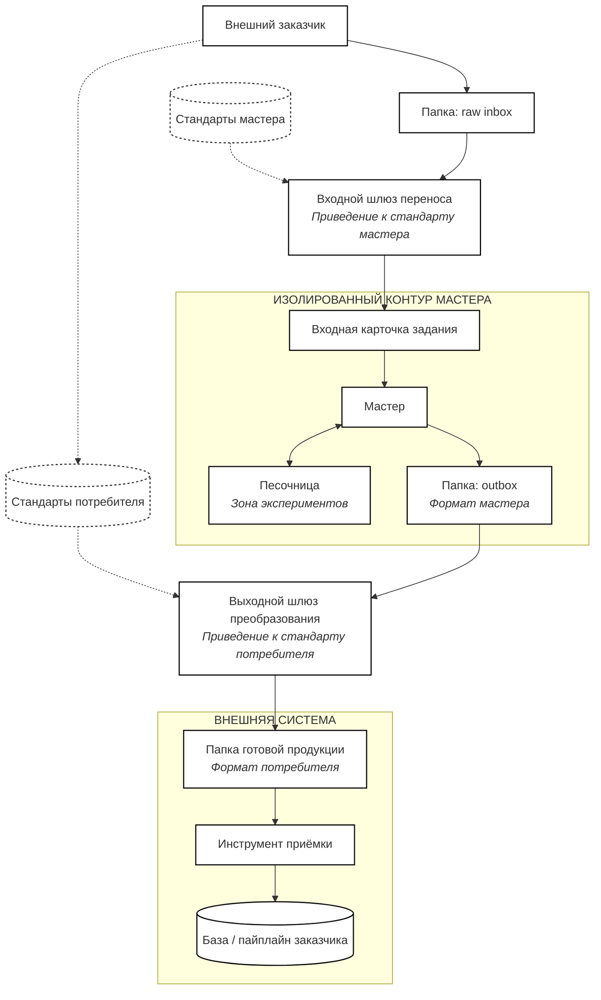

```mermaid
flowchart TD
    ExtClient[Внешний заказчик] --> RawIn[Папка: raw inbox]
    ExtClient -.-> StdClient[(Стандарты потребителя)]
    
    StdMaster[(Стандарты мастера)] -.-> InGate[Входной шлюз переноса<br><i>Приведение к стандарту мастера</i>]
    StdClient -.-> OutGate[Выходной шлюз преобразования<br><i>Приведение к стандарту потребителя</i>]
    
    RawIn --> InGate
    InGate --> InCard
    
    subgraph MasterZone [ИЗОЛИРОВАННЫЙ КОНТУР МАСТЕРА]
        InCard[Входная карточка задания] --> MasterCore[Мастер]
        MasterCore <--> Sandbox[Песочница<br><i>Зона экспериментов</i>]
        MasterCore --> OutBox[Папка: outbox<br><i>Формат мастера</i>]
    end
    
    OutBox --> OutGate
    OutGate --> ReadyOut
    
    subgraph ExtZone [ВНЕШНЯЯ СИСТЕМА]
        ReadyOut[Папка готовой продукции<br><i>Формат потребителя</i>] --> Receiver[Инструмент приёмки]
        Receiver --> ClientStorage[(База / пайплайн заказчика)]
    end

    classDef storage fill:#fff,stroke:#333,stroke-width:1.5px,stroke-dasharray: 3 3;
    classDef node fill:#fff,stroke:#000,stroke-width:1.5px;
    class StdMaster,StdClient storage;
    class ExtClient,RawIn,InGate,InCard,MasterCore,Sandbox,OutBox,OutGate,ReadyOut,Receiver,ClientStorage node;
```