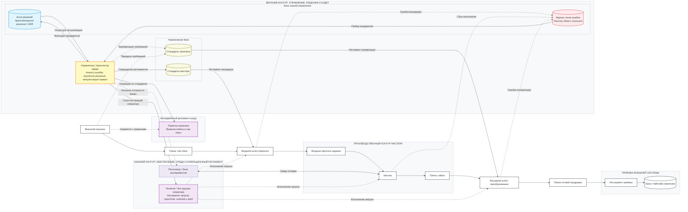

---
cssclasses:
  - landscape
---

# Мастер-контур: Полная расширенная архитектура

```mermaid
flowchart LR
    %% ========================================================
    %% ВЕРХНИЙ ЭТАЖ: УПРАВЛЕНИЕ, РЕШЕНИЯ И АУДИТ (Сверху вниз ↓)
    %% ========================================================
    subgraph GovernancePlane [ВЕРХНИЙ КОНТУР: УПРАВЛЕНИЕ, РЕШЕНИЯ И АУДИТ]
        direction TB
        
        subgraph DecisionBlock [База знаний управления]
            direction LR
            ADR[(Блок решений<br><i>Архитектурные решения / ADR</i>)]
            ErrorLogs[(Журнал логов ошибок<br><i>Реестр сбоев и коллизий</i>)]
        end

        Manager[Управленец / Архитектор среды<br><i>Анализ ошибок, принятие решений, актуализация правил</i>]

        subgraph StandardsStore [Нормативная база]
            direction LR
            StdMaster[(Стандарты мастера)]
            StdClient[(Стандарты заказчика)]
        end
        
        ErrorLogs -->|Разбор инцидентов| Manager
        Manager -->|Фиксация прецедентов| ADR
        ADR -->|Опора для актуализации| Manager
        Manager -->|Утверждение регламентов| StdMaster
        Manager -.->|Верификация требований| StdClient
    end

    %% ========================================================
    %% ПОГРАНИЧНЫЙ БЛОК: ИНСТРУКЦИЯ ЗАКАЗЧИКА
    %% ========================================================
    subgraph ClientDocs [Интерфейсный регламент входа]
        direction TB
        ExtManual[Памятка заказчика<br><i>Правила подачи в raw inbox</i>]
    end

    Manager -->|Генерация из стандартов| ExtManual

    %% ========================================================
    %% СРЕДНИЙ ЭТАЖ: ПРОИЗВОДСТВЕННЫЙ КОНВЕЙЕР (Слева направо →)
    %% ========================================================
    ExtClient[Внешний заказчик] -.->|Сверяется с правилами| ExtManual
    ExtClient --> RawIn[Папка: raw inbox]
    ExtClient -.->|Передача требований| StdClient
    
    RawIn --> InGate[Входной шлюз переноса]
    
    subgraph MasterZone [ПРОИЗВОДСТВЕННЫЙ КОНТУР МАСТЕРА]
        direction LR
        InCard[Входная карточка задания] --> MasterCore[Мастер]
        MasterCore --> OutBox[Папка: outbox]
    end

    InGate --> InCard
    OutBox --> OutGate[Выходной шлюз преобразования]
    OutGate --> ReadyOut[Папка готовой продукции]
    
    subgraph ExtSystem [ПРИЕМКА ВНЕШНЕЙ СИСТЕМЫ]
        direction LR
        Receiver[Инструмент приёмки] --> ClientPipeline[(База / пайплайн заказчика)]
    end
    ReadyOut --> Receiver

    %% ========================================================
    %% НИЖНИЙ ЭТАЖ: ОБЕСПЕЧЕНИЕ, СРЕДА И RUNBOOK (Снизу вверх ↑)
    %% ========================================================
    subgraph SupportPlane [НИЖНИЙ КОНТУР: ОБЕСПЕЧЕНИЕ, СРЕДА И ОПЕРАЦИОННЫЙ РЕГЛАМЕНТ]
        direction LR
        Sandbox[Песочница / Зона экспериментов]
        Runbook[Runbook / Инструкция оператора<br><i>Регламент запуска скриптов, шлюзов и сред</i>]
    end

    Manager -->|Спуск инструкций оператора| Runbook

    %% ========================================================
    %% МЕЖУРОВНЕВЫЕ СВЯЗИ
    %% ========================================================
    %% Управление (Сверху вниз)
    StdMaster -->|Регламент валидации| InGate
    StdClient -->|Регламент конвертации| OutGate

    %% Обеспечение и действия оператора (Снизу вверх)
    Sandbox <-->|Среда отладки| MasterCore
    Runbook -.->|Исполнение запуска| InGate
    Runbook -.->|Исполнение запуска| MasterCore
    Runbook -.->|Исполнение запуска| OutGate
    Manager -.->|Контроль готовности среды| Sandbox

    %% Телеметрия и обратная связь (Снизу вверх в контур управления)
    InGate -.->|Ошибки валидации| ErrorLogs
    MasterCore -.->|Сбои исполнения| ErrorLogs
    OutGate -.->|Ошибки конвертации| ErrorLogs

    %% ========================================================
    %% СТИЛИЗАЦИЯ
    %% ========================================================
    classDef manager fill:#fff9c4,stroke:#f57f17,stroke-width:2px;
    classDef decisions fill:#e1f5fe,stroke:#0288d1,stroke-width:1.5px;
    classDef logs fill:#ffebee,stroke:#d32f2f,stroke-width:1.5px;
    classDef control fill:#f9fbe7,stroke:#827717,stroke-width:1.5px;
    classDef docs fill:#f3e5f5,stroke:#7b1fa2,stroke-width:1.5px;
    classDef process fill:#ffffff,stroke:#263238,stroke-width:1.5px;
    classDef support fill:#ede7f6,stroke:#512da8,stroke-width:1.5px,stroke-dasharray: 4 4;
    classDef boundary fill:#f8f9fa,stroke:#b0bec5,stroke-width:1px;

    class Manager manager;
    class ADR decisions;
    class ErrorLogs logs;
    class StdMaster,StdClient control;
    class ExtManual,Runbook docs;
    class ExtClient,RawIn,InGate,InCard,MasterCore,OutBox,OutGate,ReadyOut,Receiver,ClientPipeline process;
    class Sandbox support;
    class GovernancePlane,DecisionBlock,StandardsStore,ClientDocs,MasterZone,ExtSystem,SupportPlane boundary;
```