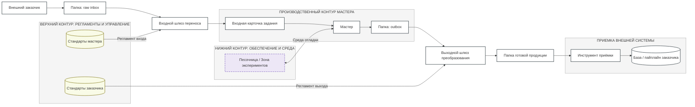

---
cssclasses:
  - landscape
---

# Мастер-контур: Производственная топология

```mermaid
flowchart LR
    %% ========================================================
    %% ВЕРХНИЙ ЭТАЖ: УПРАВЛЕНИЕ И СТАНДАРТЫ (Сверху вниз ↓)
    %% ========================================================
    subgraph ControlPlane [ВЕРХНИЙ КОНТУР: РЕГЛАМЕНТЫ И УПРАВЛЕНИЕ]
        direction LR
        StdMaster[(Стандарты мастера)]
        StdClient[(Стандарты заказчика)]
    end

    %% ========================================================
    %% СРЕДНИЙ ЭТАЖ: ПРОИЗВОДСТВЕННЫЙ КОНВЕЙЕР (Слева направо →)
    %% ========================================================
    ExtClient[Внешний заказчик] --> RawIn[Папка: raw inbox]
    RawIn --> InGate[Входной шлюз переноса]
    
    subgraph MasterZone [ПРОИЗВОДСТВЕННЫЙ КОНТУР МАСТЕРА]
        direction LR
        InCard[Входная карточка задания] --> MasterCore[Мастер]
        MasterCore --> OutBox[Папка: outbox]
    end

    InGate --> InCard
    OutBox --> OutGate[Выходной шлюз преобразования]
    OutGate --> ReadyOut[Папка готовой продукции]
    
    subgraph ExtSystem [ПРИЕМКА ВНЕШНЕЙ СИСТЕМЫ]
        direction LR
        Receiver[Инструмент приёмки] --> ClientPipeline[(База / пайплайн заказчика)]
    end
    ReadyOut --> Receiver

    %% ========================================================
    %% НИЖНИЙ ЭТАЖ: ОБЕСПЕЧЕНИЕ И СРЕДА (Снизу вверх ↑)
    %% ========================================================
    subgraph SupportPlane [НИЖНИЙ КОНТУР: ОБЕСПЕЧЕНИЕ И СРЕДА]
        Sandbox[Песочница / Зона экспериментов]
    end

    %% ========================================================
    %% МЕЖУРОВНЕВЫЕ СВЯЗИ
    %% ========================================================
    StdMaster -->|Регламент входа| InGate
    StdClient -->|Регламент выхода| OutGate
    Sandbox <-->|Среда отладки| MasterCore

    %% ========================================================
    %% СТИЛИЗАЦИЯ
    %% ========================================================
    classDef control fill:#f9fbe7,stroke:#827717,stroke-width:1.5px;
    classDef process fill:#ffffff,stroke:#263238,stroke-width:1.5px;
    classDef support fill:#ede7f6,stroke:#512da8,stroke-width:1.5px,stroke-dasharray: 4 4;
    classDef boundary fill:#f5f5f5,stroke:#9e9e9e,stroke-width:1px;

    class StdMaster,StdClient control;
    class ExtClient,RawIn,InGate,InCard,MasterCore,OutBox,OutGate,ReadyOut,Receiver,ClientPipeline process;
    class Sandbox support;
    class ControlPlane,MasterZone,ExtSystem,SupportPlane boundary;
```